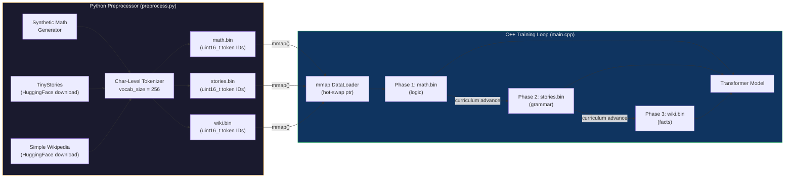
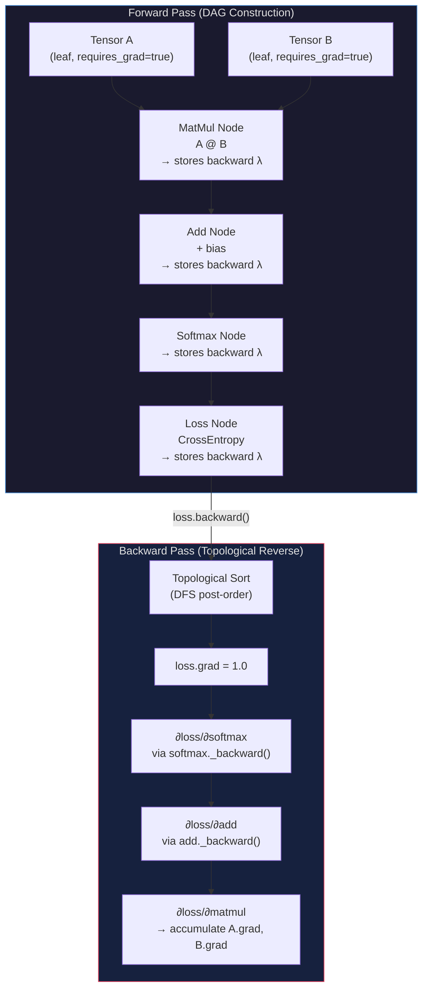
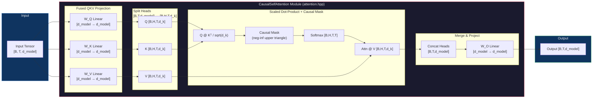
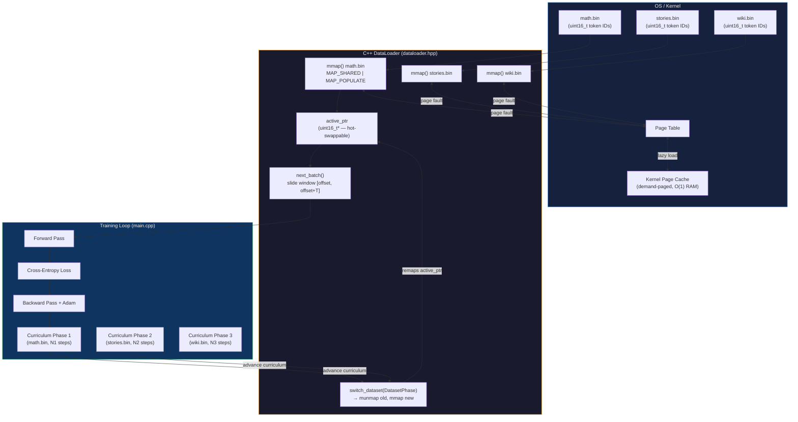

# C++ Deep Learning Engine — Implementation Plan v2

> **Flagship SDE Resume Project** · C++17 · Zero ML Dependencies · OpenMP · POSIX mmap · GTest · REST API · Curriculum Learning

---

## Overview

A from-scratch, production-grade Deep Learning Engine implementing:

- Reverse-mode automatic differentiation (autograd) over a dynamic DAG
- Full Transformer architecture with **Fused Causal Self-Attention**, FFN, LayerNorm
- **Curriculum Learning**: sequential training on three progressively complex datasets
- **Python Data Preprocessor**: downloads, char-level tokenizes, and serializes datasets to `.bin`
- **OS-level `mmap` DataLoader**: POSIX `mmap` streaming with **O(1) RAM footprint**, hot-swap between dataset pointers during the training loop
- Adam optimizer, Cross-Entropy loss, numerical gradient verification
- GTest unit test suite, benchmark harness, and a REST `/predict` endpoint

All tensor math, backprop, and neural layers use **pure C++ STL** — no Eigen, no LibTorch, no Boost.

---

## Critical Upgrades Over v1

| Upgrade | Description |
|---------|-------------|
| **Curriculum Learning** | Three training phases: Synthetic Math → TinyStories → Simple Wikipedia |
| **Python Preprocessor** | `preprocess.py` downloads & serializes all three datasets to `.bin` |
| **POSIX mmap DataLoader** | `mmap()` with `MAP_SHARED` — zero-copy, O(1) RAM; hot-swappable dataset pointers |
| **Fused Causal Self-Attention** | Explicit `CausalSelfAttention` module — Q/K/V projection + causal mask + scaled dot-product, all in one class |

---

## System & Data Flow Diagrams

### 1. Curriculum Learning Pipeline



### 2. Autograd Computation Graph — DAG Construction & Backward Pass



### 3. Fused Causal Self-Attention Data Flow



### 4. POSIX mmap Binary Data Streaming & Hot-Swap



---

## Repository File Structure

```
transformer/project/
│
├── CMakeLists.txt                  # Root CMake build (C++17, OpenMP, GTest)
├── README.md                       # High-impact README with badges & benchmarks
├── .clang-format                   # Google C++ style guide
├── .gitignore
│
├── scripts/                        # Python Data Preprocessing
│   └── preprocess.py               # Download → char-level tokenize → serialize (.bin)
│
├── data/                           # Binary Dataset Files (generated by preprocess.py)
│   ├── math.bin                    # Synthetic math token IDs (uint16_t)
│   ├── stories.bin                 # TinyStories token IDs (uint16_t)
│   └── wiki.bin                    # Simple Wikipedia token IDs (uint16_t)
│
├── engine/                         # Core Math Engine & Autograd
│   ├── tensor.hpp / .cpp           # N-dim Tensor: flat storage, strides, shape
│   ├── node.hpp / .cpp             # Autograd Node: data, grad, backward lambda
│   ├── ops.hpp / .cpp              # Differentiable ops: +, -, *, @, exp, log, sum
│   └── autograd.hpp                # backward(), topological sort, grad accumulation
│
├── nn/                             # Neural Network Modules
│   ├── module.hpp                  # Abstract Module: parameters(), zero_grad()
│   ├── linear.hpp / .cpp           # Linear layer: y = xW^T + b
│   ├── layernorm.hpp / .cpp        # Layer Normalization
│   ├── embedding.hpp / .cpp        # Embedding table lookup
│   ├── activation.hpp / .cpp       # GELU, ReLU, Sigmoid
│   ├── softmax.hpp / .cpp          # Numerically stable Softmax
│   ├── dropout.hpp / .cpp          # Dropout (training/inference mode)
│   ├── attention.hpp / .cpp        # ★ CausalSelfAttention (fused QKV, causal mask)
│   ├── feedforward.hpp / .cpp      # FFN: Linear → GELU → Linear
│   ├── transformer_block.hpp / .cpp# TransformerBlock: Attn + FFN + residuals + LN
│   └── transformer.hpp / .cpp      # Full GPT: Embedding + N blocks + LM head
│
├── data_loader/                    # Data Loading
│   ├── dataloader.hpp / .cpp       # POSIX mmap DataLoader, hot-swap switch_dataset()
│   ├── tokenizer.hpp / .cpp        # Char-level vocab: encode(), decode()
│   └── curriculum.hpp              # CurriculumScheduler: phase enum, step thresholds
│
├── optim/                          # Optimizers
│   ├── optimizer.hpp               # Abstract Optimizer base
│   ├── adam.hpp / .cpp             # AdamW (beta1=0.9, beta2=0.999, eps=1e-8)
│   └── sgd.hpp / .cpp              # SGD with momentum
│
├── loss/                           # Loss Functions
│   ├── cross_entropy.hpp / .cpp    # Cross-Entropy with log-sum-exp trick
│   └── mse.hpp / .cpp              # Mean Squared Error
│
├── server/                         # REST API Serving
│   ├── http_server.hpp / .cpp      # POSIX socket HTTP/1.1 server
│   └── inference_handler.hpp / .cpp# /predict: tokenize → forward → decode
│
├── tests/                          # GTest Unit Test Suite
│   ├── CMakeLists.txt
│   ├── test_tensor.cpp
│   ├── test_autograd.cpp
│   ├── test_grad_check.cpp         # Numerical gradient verification
│   ├── test_linear.cpp
│   ├── test_attention.cpp          # CausalSelfAttention shapes & causal mask
│   ├── test_transformer.cpp
│   ├── test_dataloader.cpp         # mmap load, batch extraction, hot-swap
│   └── test_curriculum.cpp         # Phase transitions & dataset pointer integrity
│
├── benchmarks/                     # Performance Benchmarks
│   ├── CMakeLists.txt
│   ├── bench_matmul.cpp            # Tiled vs naive matmul (GFLOPS)
│   ├── bench_attention.cpp         # CausalSelfAttention throughput (tokens/sec)
│   └── bench_dataloader.cpp        # mmap streaming throughput (GB/s)
│
└── main.cpp                        # Training entry: args → curriculum loop → checkpoint
```

---

## Development Roadmap — 15 Granular Micro-Steps

> **Rule**: No single micro-step generates more than 2–3 files. Each step is independently compilable or testable.

---

### Phase 1 — Math Engine & Autograd Core

#### Step 1.1 — Tensor Foundation
**Goal**: Define the core N-dimensional data container.

| File | Action |
|------|--------|
| `engine/tensor.hpp` | `[NEW]` — `Tensor` class: flat `std::vector<double>` storage, `shape`, `strides`, `reshape()`, bounds-checked `at()` indexing |
| `engine/tensor.cpp` | `[NEW]` — Implementation of row-major stride computation, `print()`, contiguity checks |

**Exit Criterion**: `Tensor({2,3})` can be constructed, indexed, and printed without errors.

---

#### Step 1.2 — Autograd Node & Graph
**Goal**: Implement the DAG node powering reverse-mode AD.

| File | Action |
|------|--------|
| `engine/node.hpp` | `[NEW]` — `Node` struct: `data` (Tensor), `grad` (Tensor), `_backward` (std::function lambda), `children` (vector of weak_ptr) |
| `engine/node.cpp` | `[NEW]` — Default backward no-op; gradient accumulation (`grad +=`) logic |

**Exit Criterion**: Two nodes can be linked as parent/child; `_backward()` can be called manually.

---

#### Step 1.3 — Core Differentiable Tensor Operations
**Goal**: Register all differentiable ops that populate the autograd DAG.

| File | Action |
|------|--------|
| `engine/ops.hpp` | `[NEW]` — Op declarations: `add`, `mul`, `matmul`, `exp`, `log`, `sum`, `transpose` |
| `engine/ops.cpp` | `[NEW]` — Each op: forward computation + lambda capturing parent ptrs that computes & accumulates `.grad` into children |

**Exit Criterion**: `c = matmul(a, b)` produces correct output; `c._backward()` accumulates correct gradients in `a` and `b`.

---

#### Step 1.4 — Topological Backward Pass
**Goal**: Implement `loss.backward()` traversing the full DAG in topological order.

| File | Action |
|------|--------|
| `engine/autograd.hpp` | `[NEW]` — `backward(Node& root)`: DFS post-order topological sort → set `root.grad = 1.0` → call `_backward()` in reverse topological order |

**Exit Criterion**: A 3-node chain `a → b → c`; calling `backward(c)` correctly propagates gradients all the way to `a`.

---

### Phase 2 — Neural Network Modules & Fused Causal Self-Attention

#### Step 2.1 — Module Base, Linear & LayerNorm
**Goal**: Establish the `Module` interface and its first two concrete implementations.

| File | Action |
|------|--------|
| `nn/module.hpp` | `[NEW]` — Abstract `Module`: pure virtual `forward()`, `parameters()` returning all trainable `Node*`, `zero_grad()` |
| `nn/linear.hpp` / `nn/linear.cpp` | `[NEW]` — `Linear(in_features, out_features)`: weight & bias as `Node`s; `forward(x) = x @ W^T + b` |
| `nn/layernorm.hpp` / `nn/layernorm.cpp` | `[NEW]` — `LayerNorm(d_model)`: trainable scale γ and shift β; normalize over the last dimension |

**Exit Criterion**: `Linear(4,8).forward(x)` produces shape `[B,8]`; `LayerNorm` output has mean ≈ 0, std ≈ 1.

---

#### Step 2.2 — Embedding, Activation & Softmax
**Goal**: Implement token embedding lookup, GELU activation, and numerically stable Softmax.

| File | Action |
|------|--------|
| `nn/embedding.hpp` / `nn/embedding.cpp` | `[NEW]` — `Embedding(vocab_size, d_model)`: lookup table; `forward(token_ids)` returns `[T, d_model]` |
| `nn/activation.hpp` / `nn/activation.cpp` | `[NEW]` — `gelu(x)` with exact erf formula; `relu(x)`; `sigmoid(x)` |
| `nn/softmax.hpp` / `nn/softmax.cpp` | `[NEW]` — Numerically stable softmax: subtract row-max before exp |

**Exit Criterion**: `Embedding(256, 64).forward({3,7,1})` returns shape `[3, 64]`; GELU output matches PyTorch reference values.

---

#### Step 2.3 — ★ Fused Causal Self-Attention Module
**Goal**: Implement the star architectural component — `CausalSelfAttention`. This is the most interview-critical class in the entire project.

| File | Action |
|------|--------|
| `nn/attention.hpp` | `[NEW]` — `CausalSelfAttention(d_model, n_heads)`: declares W_Q, W_K, W_V, W_O as `Linear` members; declares `forward()` and `_build_causal_mask()` |
| `nn/attention.cpp` | `[NEW]` — **Full implementation**: (1) Project Q = x·W_Q, K = x·W_K, V = x·W_V; (2) Reshape to `[B,H,T,d_k]`; (3) Scaled dot-product `Q@K^T / sqrt(d_k)`; (4) Add causal mask (upper triangle = −1e9); (5) Softmax over T-dim; (6) Weighted sum `Attn @ V`; (7) Concat & reshape to `[B,T,d_model]`; (8) Project through W_O |

> [!IMPORTANT]
> **System Design Interview Highlight**: `CausalSelfAttention` is explicitly separated from a generic `MultiHeadAttention` to emphasize the autoregressive causal masking property. Key talking points: (a) the lower-triangular mask enforces that position `t` can only attend to positions `≤ t`; (b) the four projection matrices W_Q, W_K, W_V, W_O are explicitly defined as distinct `Linear` members rather than a single fused matrix, making the math transparent; (c) the `sqrt(d_k)` scaling prevents dot products from entering the flat region of softmax.

**Exit Criterion**: `CausalSelfAttention(64, 4).forward(x)` with `x.shape=[2,16,64]` produces output `[2,16,64]`; attention weight upper triangle is exactly zero after softmax.

---

#### Step 2.4 — FFN, TransformerBlock & Full Transformer
**Goal**: Assemble the full GPT-style Transformer from the components in Steps 2.1–2.3.

| File | Action |
|------|--------|
| `nn/feedforward.hpp` / `nn/feedforward.cpp` | `[NEW]` — `FeedForward(d_model, d_ff)`: `Linear → GELU → Linear`; d_ff = 4×d_model |
| `nn/transformer_block.hpp` / `nn/transformer_block.cpp` | `[NEW]` — `TransformerBlock`: Pre-LN → CausalSelfAttention → residual add; Pre-LN → FeedForward → residual add |
| `nn/transformer.hpp` / `nn/transformer.cpp` | `[NEW]` — `Transformer(config)`: token Embedding + positional Embedding + N×TransformerBlock + final LayerNorm + LM-head Linear |

**Exit Criterion**: `Transformer.forward(token_ids)` returns logits of shape `[B, T, vocab_size]`.

---

### Phase 3 — Python Data Preprocessing & POSIX mmap DataLoader

#### Step 3.1 — Python Preprocessor (Datasets → `.bin`)
**Goal**: Write the Python script that downloads all three datasets and serializes them into a uniform `.bin` format consumable by the C++ DataLoader.

| File | Action |
|------|--------|
| `scripts/preprocess.py` | `[NEW]` — Three modes via CLI: `--dataset {math,stories,wiki}`. **math**: generates N synthetic "A op B = C\n" strings. **stories**: downloads TinyStories via HuggingFace `datasets`. **wiki**: downloads `wikipedia` 20220301.simple split. All modes: char-level tokenize → cast to `uint16_t` → write binary header (`uint32 magic=0xDEADBEEF`, `uint32 vocab_size`, `uint64 num_tokens`) + raw token array to `.bin`. |

> [!NOTE]
> **Char-Level Tokenizer**: `vocab_size = 256` (one byte per character, encoding all ASCII). The `.bin` header format — `[uint32 magic][uint32 vocab_size][uint64 num_tokens][uint16_t... token_ids]` — is fixed and shared across all three datasets, allowing the C++ DataLoader to validate and memory-map the payload region identically for every phase.

**Run Commands**:
```bash
pip install datasets wikipedia-api
python scripts/preprocess.py --dataset math    --output data/math.bin
python scripts/preprocess.py --dataset stories --output data/stories.bin
python scripts/preprocess.py --dataset wiki    --output data/wiki.bin
```

**Exit Criterion**: All three `.bin` files generated and parseable; a Python round-trip snippet reads back 10 tokens and decodes them to the original characters correctly.

---

#### Step 3.2 — POSIX mmap DataLoader & CurriculumScheduler
**Goal**: Implement the zero-copy C++ DataLoader using `mmap` and the curriculum phase switching logic.

| File | Action |
|------|--------|
| `data_loader/dataloader.hpp` / `data_loader/dataloader.cpp` | `[NEW]` — `DataLoader`: `open()` → validate header → `mmap(MAP_SHARED | MAP_POPULATE)` → cast payload to `uint16_t*`. `next_batch(B, T)` slides a window `[offset, offset+B*T]`. `switch_dataset(path)` calls `munmap()` on the old mapping then `mmap()` on the new path — model weights untouched. |
| `data_loader/curriculum.hpp` | `[NEW]` — `CurriculumScheduler`: `enum DatasetPhase { MATH, STORIES, WIKI }`; `step_thresholds[3]`; `advance(int step) → DatasetPhase`; `dataset_path(DatasetPhase) → std::string` |

> [!IMPORTANT]
> **O(1) RAM Guarantee**: `mmap` maps the full file into virtual address space but the kernel demand-pages physical frames only as they are accessed. Process RSS stays bounded to the active working set regardless of total `.bin` file size — a 10 GB `wiki.bin` uses only the pages currently being batched. This is a core OS-level systems design talking point.

**Exit Criterion**: `DataLoader("data/math.bin").next_batch(4, 128)` returns `x[4][128]` and `y[4][128]` (y is x shifted by 1 token); `switch_dataset("data/stories.bin")` remaps correctly without crash or memory leak.

---

### Phase 4 — Loss, Optimizer & Curriculum Training Loop

#### Step 4.1 — Cross-Entropy Loss & AdamW Optimizer
**Goal**: Implement the two remaining algorithmic training components.

| File | Action |
|------|--------|
| `loss/cross_entropy.hpp` / `loss/cross_entropy.cpp` | `[NEW]` — `cross_entropy(logits [B,T,V], targets [B,T])`: log-sum-exp stabilized NLL; averaged over B×T tokens; registers backward lambda |
| `optim/adam.hpp` / `optim/adam.cpp` | `[NEW]` — `AdamW(params, lr, beta1=0.9, beta2=0.999, eps=1e-8, weight_decay=0.01)`: per-parameter first/second moment vectors, bias correction, decoupled weight decay |

**Exit Criterion**: `cross_entropy` output matches PyTorch reference to 1e-6; AdamW converges a 2-layer MLP on a toy regression in < 500 steps.

---

#### Step 4.2 — Main Curriculum Training Loop
**Goal**: Wire every component into a single `main.cpp` entry point running all three curriculum phases end-to-end.

| File | Action |
|------|--------|
| `main.cpp` | `[NEW]` — Parse CLI args (`--d_model`, `--n_heads`, `--n_layers`, `--lr`, `--phase_steps N1,N2,N3`). Instantiate `Transformer`, `AdamW`, `DataLoader`, `CurriculumScheduler`. Training loop: `scheduler.advance(step)` → if phase changed call `loader.switch_dataset(path)` → `next_batch()` → `transformer.forward()` → `cross_entropy()` → `backward()` → `adam.step()` → `zero_grad()`. Log loss every 100 steps. Save checkpoint `.bin` at each phase boundary. |

> [!NOTE]
> **Curriculum Phase Defaults** (all configurable via CLI): Phase 1 MATH: 5,000 steps; Phase 2 STORIES: 10,000 steps; Phase 3 WIKI: 20,000 steps.

**Exit Criterion**: `./build/transformer --d_model 64 --n_heads 4 --n_layers 2 --phase_steps 100,200,400` runs all three curriculum phases without segfault; loss decreases within each phase.

---

### Phase 5 — Verification, Tests, Benchmarks & REST API

#### Step 5.1 — GTest Unit Tests: Engine & NN Modules
**Goal**: Validate math engine, autograd, and all neural network modules.

| File | Action |
|------|--------|
| `tests/test_tensor.cpp` | `[NEW]` — Shape, stride, reshape, out-of-bounds assertion |
| `tests/test_autograd.cpp` | `[NEW]` — DAG construction, topological sort correctness, `backward()` chain |
| `tests/test_grad_check.cpp` | `[NEW]` — Numerical gradient: `(f(x+e) − f(x−e)) / 2e` vs analytical `.grad`; tolerance 1e-6 |
| `tests/test_linear.cpp` | `[NEW]` — Forward output shape; backward grad shapes; `zero_grad()` clears all |
| `tests/test_attention.cpp` | `[NEW]` — `CausalSelfAttention` output shape `[B,T,d_model]`; causal mask upper triangle = 0 after softmax |

**Exit Criterion**: `ctest --output-on-failure` — all 5 test files pass with 0 failures.

---

#### Step 5.2 — GTest Tests: DataLoader & Curriculum + Benchmarks
**Goal**: Validate the data pipeline and measure system-level performance.

| File | Action |
|------|--------|
| `tests/test_dataloader.cpp` | `[NEW]` — mmap load correctness; `next_batch()` token values; `switch_dataset()` hot-swap without memory leak |
| `tests/test_curriculum.cpp` | `[NEW]` — Phase advances at correct step counts; `dataset_path()` returns correct path strings |
| `benchmarks/bench_matmul.cpp` | `[NEW]` — Tiled vs naive matmul; report GFLOPS |
| `benchmarks/bench_attention.cpp` | `[NEW]` — `CausalSelfAttention` forward throughput; report tokens/sec |
| `benchmarks/bench_dataloader.cpp` | `[NEW]` — mmap streaming throughput; report GB/s |

**Exit Criterion**: All 2 test files pass; `bench_matmul` reports > 2 GFLOPS; `bench_dataloader` approaches disk read speed.

---

#### Step 5.3 — CMake Build System & REST `/predict` Endpoint
**Goal**: Wire all build targets in CMake and add the HTTP inference server.

| File | Action |
|------|--------|
| `CMakeLists.txt` | `[NEW]` — Root CMake: C++17, `-fopenmp`, GTest via FetchContent, `enable_testing()`; links `engine`, `nn`, `data_loader`, `optim`, `loss`, `server` as static libs; includes `tests/` and `benchmarks/` subdirectories |
| `server/http_server.hpp` / `server/http_server.cpp` | `[NEW]` — Raw POSIX socket HTTP/1.1 server; parses GET/POST; routes `/predict` to inference handler |
| `server/inference_handler.hpp` / `server/inference_handler.cpp` | `[NEW]` — Accepts JSON `{"prompt": "..."}` → char tokenize → `Transformer.forward()` → greedy decode (argmax) → return JSON `{"completion": "..."}` |

**Exit Criterion**: `cmake -B build && cmake --build build` succeeds with 0 errors; `curl -X POST localhost:8080/predict -d '{"prompt":"1 + 1 ="}'` returns valid JSON.

---

## Key Architectural Decisions

### Memory Layout
| Decision | Rationale |
|----------|-----------|
| `std::vector<double>` flat 1D storage | Maximizes L1/L2 cache locality vs nested vectors |
| Row-major stride ordering | Matches C++ memory layout; enables SIMD auto-vectorization |
| `std::shared_ptr<Node>` for DAG nodes | Safe shared ownership; `weak_ptr` for backward edges to break cycles |

### Autograd Design
| Decision | Rationale |
|----------|-----------|
| Lambda `_backward` stored in each Node | Closures capture parent pointers at op creation time |
| Topological sort via DFS post-order | Guarantees children processed before parents in backward |
| Gradient accumulation (`+=`) at leaf nodes | Supports branching DAGs where one tensor fans out to multiple ops |

### Curriculum Learning Design
| Decision | Rationale |
|----------|-----------|
| Sequential phases: Math → Stories → Wiki | Each phase provides inductive bias for the next: logic before grammar before facts |
| `munmap` + `mmap` on dataset switch | Zero leftover RSS from previous dataset; clean virtual address remapping per phase |
| Phase step thresholds via CLI args | Fully reproducible experiments without recompilation |

### Performance
| Decision | Rationale |
|----------|-----------|
| Cache-blocked matmul, `BLOCK_SIZE=64` | Fits L1 cache; 3–5× speedup over naive O(n³) |
| `#pragma omp parallel for` on outer loops | Utilizes all CPU cores for matmul and attention passes |
| `mmap(MAP_SHARED | MAP_POPULATE)` | Zero-copy dataset access; O(1) RSS regardless of file size |
| `uint16_t` token storage in `.bin` | 2 bytes/token supports vocab up to 65,536; halves I/O vs `int32_t` |

---

## Verification Plan

### Automated Tests (GTest)
```bash
cmake -B build -DCMAKE_BUILD_TYPE=Debug -DENABLE_ASAN=ON
cmake --build build -j$(nproc)
ctest --test-dir build --output-on-failure
```

### Numerical Gradient Check
- Per parameter tensor: `(f(x+e) − f(x−e)) / 2e` vs analytical `.grad`
- Tolerance: `< 1e-6` relative error
- Run: `./build/tests/test_grad_check`

### End-to-End Curriculum Training Smoke Test
```bash
# Step 1: Generate all three binary datasets
python scripts/preprocess.py --dataset math    --output data/math.bin
python scripts/preprocess.py --dataset stories --output data/stories.bin
python scripts/preprocess.py --dataset wiki    --output data/wiki.bin

# Step 2: Run all 3 curriculum phases (small config for CI)
./build/transformer \
  --d_model 64 --n_heads 4 --n_layers 2 \
  --phase_steps 500,1000,2000 \
  --lr 3e-4
```
**Expected**: Loss decreases within each phase; dataset hot-swap logged at step boundaries; Valgrind reports 0 memory leaks.

### Performance Benchmarks
```bash
./build/benchmarks/bench_matmul      # Expected: > 2 GFLOPS on modern CPU
./build/benchmarks/bench_attention   # Expected: > 10k tokens/sec (d=64, T=128)
./build/benchmarks/bench_dataloader  # Expected: near-disk-speed streaming (GB/s)
```

---

## Open Questions

> [!IMPORTANT]
> **Vocabulary Sharing Across Phases**: All three datasets use the same char-level tokenizer (`vocab_size=256`), so no embedding table reset is required on curriculum advance. If a BPE tokenizer is added later, the embedding must be re-initialized at each phase boundary. Decision: locked to char-level for v2.

> [!IMPORTANT]
> **Precision**: `double` (64-bit) is used throughout for gradient verification correctness. A `float` specialization via template parameter can be added later for GPU/SIMD benchmarks. Locked as `double` for v2.

> [!IMPORTANT]
> **HTTP Server**: Raw POSIX sockets (zero dependencies) for the `/predict` endpoint. The header-only `cpp-httplib` is a drop-in upgrade — flagged as a v3 option.

> [!NOTE]
> **Target Platform**: Linux/WSL2 (POSIX `mmap`, `open()`, OpenMP). Windows native requires `MapViewOfFile` fallback. A compile-time `#ifdef _WIN32` shim in `dataloader.cpp` is planned for Step 3.2 but not required for v2 acceptance.

> [!NOTE]
> **Dataset Download Time**: TinyStories (~1.8 GB) and Simple Wikipedia (~600 MB) vary by network speed. `preprocess.py` caches raw downloads to `.cache/` and skips re-download if the target `.bin` already exists.
